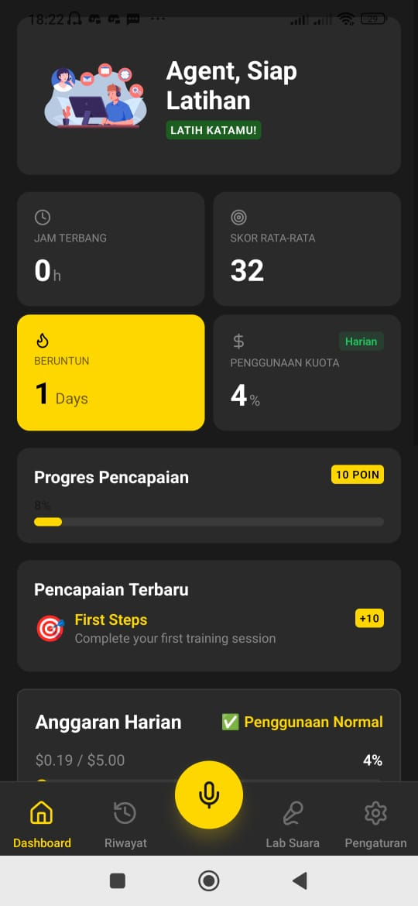
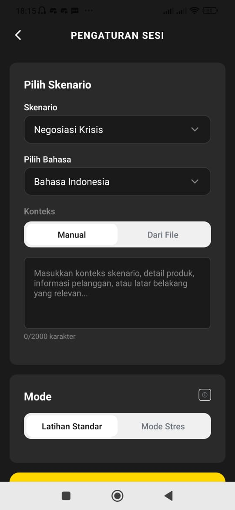
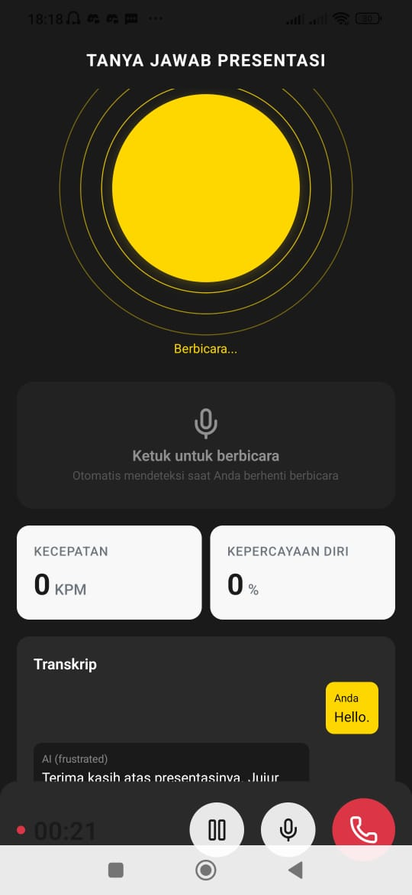
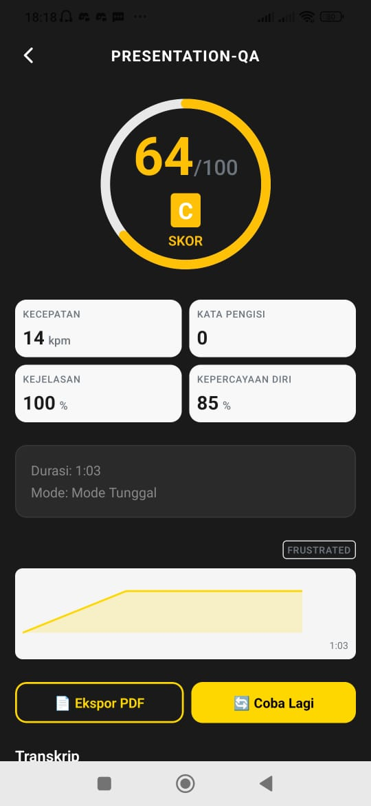

<p align="center">
  
</p>

<h1 align="center">🎙️ Resonance</h1>

<p align="center">
  <strong>AI-Powered High-Stakes Communication Training</strong>
</p>

<p align="center">
  <a href="#-features">Features</a> •
  <a href="#-download">Download</a> •
  <a href="#-screenshots">Screenshots</a> •
  <a href="#-getting-started">Getting Started</a> •
  <a href="#-tech-stack">Tech Stack</a> •
  <a href="#-contributing">Contributing</a>
</p>

<p align="center">
  
  
  
  
</p>

---

## 🌟 Overview

**Resonance** is an offline-first Android mobile application that provides high-stakes communication training through real-time AI voice interactions. Train for critical conversations with AI-powered simulations that adapt to your performance.

Perfect for:
- 💼 **Sales Professionals** - Practice difficult negotiations and objection handling
- 📞 **Customer Service Representatives** - Handle crisis situations and complaints
- 👔 **Managers** - Prepare for performance reviews and difficult conversations
- 🎤 **Public Speakers** - Master Q&A sessions and investor pitches

---

## ✨ Features

### 🎯 Core Features

| Feature | Description |
|---------|-------------|
| **Ultra-Low Latency** | Voice interactions under 800ms response time |
| **Natural Interruption** | VAD (Voice Activity Detection) allows natural barge-in |
| **25+ Scenarios** | Sales, Customer Service, HR, Presentations & more |
| **Real-time Metrics** | Pace (WPM), Clarity, Confidence, Filler Words |
| **Bilingual Support** | Indonesian 🇮🇩 & English 🇬🇧 |

### 🔥 Chaos Engine

Simulate real-world disruptions to build resilience:

- 🎭 **Random Voice Gen** - Pitch and speed variations
- 🔊 **Background Noise** - Office, rain, traffic, cafe sounds
- ⚡ **Hardware Failure** - Mic mute, connection drops simulation

### 🎙️ Voice Lab

- Clone up to 5 custom voices with ElevenLabs
- Adjust stability and similarity settings
- TTS Playground for voice testing

### 📊 Analytics & Reports

- Comprehensive session reports with AI coaching feedback
- Performance trends and progress tracking
- Export reports as PDF/CSV
- Achievement system with gamification

### 🔒 Privacy-First

- **Offline-First**: Full functionality without internet
- **Local Storage**: All data stays on your device
- **Encrypted Keys**: API keys stored securely

---

## 📥 Download

### Latest Release

<p align="center">
  <a href="https://github.com/YOUR_USERNAME/resonance-mobile-app/releases/latest">
    
  </a>
</p>

**Installation Steps:**

1. Download the latest `.apk` file from [Releases](https://github.com/YOUR_USERNAME/resonance-mobile-app/releases)
2. Enable "Install from Unknown Sources" in your Android settings
3. Open the downloaded APK file
4. Tap "Install"
5. Launch Resonance and start training!

> ⚠️ **Note**: You'll need to configure your own API keys (ElevenLabs & Gemini) in Settings for full functionality. The app works in Mock Mode without API keys.

---

## 📱 Screenshots

<p align="center">
  
  
  
  
</p>

---

## 🚀 Getting Started

### Prerequisites

- Node.js v18 or higher
- npm or yarn
- Android Studio (for development)
- Expo CLI (`npm install -g expo-cli`)

### Installation

```bash
# Clone the repository
git clone https://github.com/YOUR_USERNAME/resonance-mobile-app.git
cd resonance-mobile-app

# Install dependencies
npm install

# Start development server
npx expo start

# Run on Android
npx expo run:android
```

### API Configuration

To use AI features, you'll need:

1. **ElevenLabs API Key** - [Get it here](https://elevenlabs.io/)
2. **Gemini API Key** - [Get it here](https://makersuite.google.com/app/apikey)

Configure keys in: `Settings > API Configuration`

---

## 🛠️ Tech Stack

### Framework & Platform

| Technology | Version | Purpose |
|------------|---------|---------|
| Expo SDK | 52.0.0 | Managed workflow with config plugins |
| React Native | 0.76.0 | Cross-platform mobile development |
| Expo Router | 4.0.0 | File-based navigation |

### UI & Styling

| Technology | Purpose |
|------------|---------|
| NativeWind | Tailwind CSS for React Native |
| Moti | Declarative animations |
| React Native Reanimated | Performance animations |
| Lucide Icons | Beautiful icon library |
| Lottie | High-performance animations |

### AI & Audio

| Technology | Purpose |
|------------|---------|
| Gemini 2.5 Flash | AI conversation logic |
| ElevenLabs WebSocket | Real-time TTS streaming |
| react-native-live-audio-stream | Real-time audio input |
| expo-av | Audio playback and recording |

### Data & Storage

| Technology | Purpose |
|------------|---------|
| expo-sqlite | Local SQLite database |
| expo-secure-store | Encrypted API key storage |
| Zustand | Lightweight state management |

---

## 📁 Project Structure

```
resonance-mobile-app/
├── 📂 app/                    # Expo Router screens
│   ├── (tabs)/               # Tab navigation screens
│   ├── session-setup.jsx     # Training configuration
│   ├── simulation.jsx        # Active simulation
│   ├── stress-mode.jsx       # Stress test mode
│   └── report.jsx            # Session report
├── 📂 components/             # Reusable UI components
│   ├── ui/                   # Base UI components
│   ├── audio/                # Audio-related components
│   └── charts/               # Data visualization
├── 📂 services/               # Core business logic
│   ├── audioEngine.js        # Audio I/O management
│   ├── vadService.js         # Voice Activity Detection
│   ├── elevenLabsService.js  # ElevenLabs integration
│   ├── geminiService.js      # Gemini AI logic
│   └── chaosEngine.js        # Disruption simulation
├── 📂 hooks/                  # Custom React hooks
├── 📂 stores/                 # Zustand state stores
├── 📂 constants/              # App configuration
├── 📂 utils/                  # Utility functions
└── 📂 assets/                 # Static assets
```

---

## 🎮 Usage Guide

### 1. First Launch

- Complete the onboarding tutorial
- Configure your API keys in Settings (optional for Mock Mode)
- Set your preferred language (Indonesian/English)

### 2. Start Training

1. Tap the **yellow microphone button** on the dashboard
2. Select a **scenario** (e.g., Sales Objection, Customer Complaint)
3. Choose **training mode**:
   - **Standard Training**: Single conversation practice
   - **Stress Mode**: Handle multiple callers under pressure
4. Configure **Chaos Engine** options (optional)
5. Tap **Start Simulation**

### 3. During Simulation

- Speak naturally - the AI will respond in real-time
- **Interrupt anytime** - VAD detects when you want to speak
- Monitor your metrics in the HUD
- Tap **End Call** when finished

### 4. Review Performance

- View your **overall score** and letter grade
- Check detailed metrics (Pace, Clarity, Confidence)
- Read **AI coaching feedback**
- Export report as PDF/CSV

---

## 🧪 Testing

```bash
# Run all tests
npm test

# Run tests in watch mode
npm run test:watch

# Run with coverage
npm run test:coverage
```

---

## 🏗️ Building

### Development Build

```bash
npx expo run:android
```

### Production APK

```bash
# Using EAS Build
eas build --platform android --profile production

# Local build
npx expo prebuild
cd android && ./gradlew assembleRelease
```

---

## 🤝 Contributing

Contributions are welcome! Please feel free to submit a Pull Request.

1. Fork the repository
2. Create your feature branch (`git checkout -b feature/AmazingFeature`)
3. Commit your changes (`git commit -m 'Add some AmazingFeature'`)
4. Push to the branch (`git push origin feature/AmazingFeature`)
5. Open a Pull Request

---

## 📄 License

This project is licensed under the MIT License - see the [LICENSE](LICENSE) file for details.

---

## 🙏 Acknowledgments

- [ElevenLabs](https://elevenlabs.io/) - AI Voice Synthesis
- [Google Gemini](https://deepmind.google/technologies/gemini/) - AI Language Model
- [Expo](https://expo.dev/) - React Native Framework
- [Lucide](https://lucide.dev/) - Beautiful Icons

---

<p align="center">
  Made with ❤️ for better communication
</p>

<p align="center">
  <a href="https://github.com/YOUR_USERNAME/resonance-mobile-app/issues">Report Bug</a>
  •
  <a href="https://github.com/YOUR_USERNAME/resonance-mobile-app/issues">Request Feature</a>
</p>
